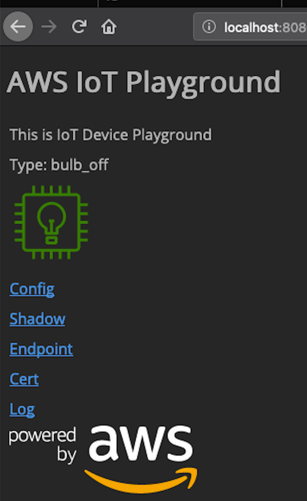
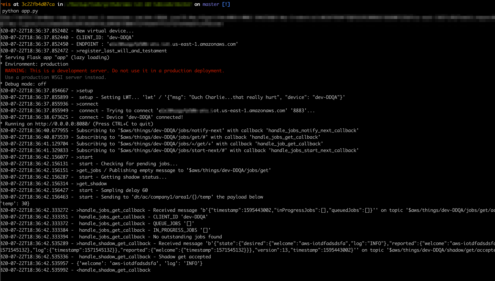

# AWS IoT Playground

A project to play with virtual devices and learn more about AWS IoT features such as device provisioning, device management, and security.






# Install the Required Infrastructure

To build this app, you need to be in this example's root folder. Then run the following:

```
$ cd cdk
$ python3 -m venv .env
$ source .env/bin/activate
$ pip install -r requirements.txt
```

This will install the necessary CDK, then this example's dependencies, and then build your Python files and your CloudFormation template.

Install the latest version of the AWS CDK CLI:

```
$ npm i -g aws-cdk
```
# Provision your First Device

# Scripts

There are different scripts to help doing common operations.
* broker-debug.sh - connects to AWS IoT Broker and listen all messages
* show-exports.sh - display environment variables that may help you run the code on your computer. You need to copy and paste then on the terminal
* push.sh - publish the new virtual device code. Needs to wait to finish the preparation of the new container, later it will be available for provisioning

## Control Plane Operations

* cp-create-thing.sh - create a new device

# Structure

* control-plane
* docs
* virtual-device
* lambdas

## Standard Used

Files use - (dash) to separate instead of _ (underline). The exception is for python files that don't play well with - (dash).

---

# TODO
- [ ] Command-and-reply pattern
- [ ] Integration with Cognito
- [ ] Control plane with web interface 
- [ ] Rogue device
